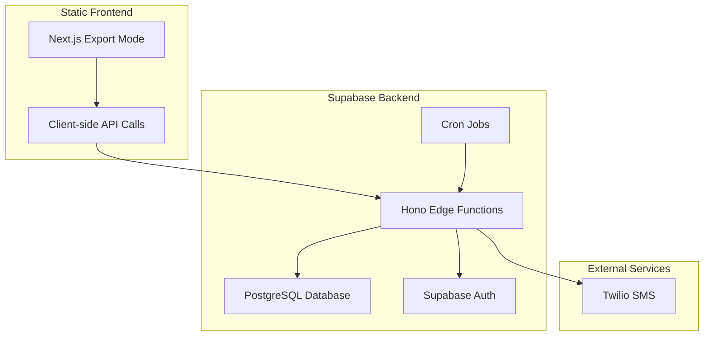

# Design Document

## Overview

This design outlines the migration of API routes from Next.js to a Hono-based backend running on Supabase Edge Functions, while converting the Next.js frontend to export mode for static deployment. The architecture will separate concerns by moving all server-side logic to dedicated Edge Functions and enabling the frontend to make client-side API calls.

## Architecture

### Current Architecture
- Next.js full-stack application with API routes in `/app/api/`
- Server-side rendering with API routes handling authentication and database operations
- Database migrations stored in `frontend/scripts/`
- Manual scheduling for monitor checks

### Target Architecture
- **Frontend**: Static Next.js application (export mode) deployed as static files
- **Backend**: Hono-based Edge Functions in Supabase handling all API logic
- **Database**: Supabase PostgreSQL with migrations managed in backend directory
- **Scheduling**: Supabase cron jobs for automated monitor checks
- **Authentication**: Supabase Auth with JWT validation in Edge Functions



## Components and Interfaces

### 1. Hono Edge Functions Structure

```
backend/supabase/functions/
├── api/
│   ├── index.ts                    # Main Hono app with routing
│   ├── middleware/
│   │   ├── auth.ts                 # JWT authentication middleware
│   │   ├── cors.ts                 # CORS configuration
│   │   └── error-handler.ts        # Global error handling
│   ├── routes/
│   │   ├── admin.ts                # Admin SMS cost monitoring
│   │   ├── monitors.ts             # Monitor CRUD operations
│   │   ├── monitor-check.ts        # Monitor checking logic
│   │   └── webhooks.ts             # SMS status webhooks
│   ├── services/
│   │   ├── sms-service.ts          # SMS sending service
│   │   ├── notification-service.ts # Notification handling
│   │   ├── sms-cost-monitor.ts     # Cost monitoring service
│   │   └── sms-rate-limiter.ts     # Rate limiting service
│   └── utils/
│       ├── config.ts               # Configuration management
│       ├── supabase.ts             # Supabase client setup
│       └── validation.ts           # Request validation

```

### 2. API Endpoints Mapping

| Current Next.js Route | New Hono Route | Method | Description |
|----------------------|----------------|---------|-------------|
| `/api/admin/sms-costs` | `/api/admin/sms-costs` | GET, POST | SMS cost monitoring and management |
| `/api/monitors` | `/api/monitors` | GET | Fetch user monitors |
| `/api/monitors/check` | `/api/monitors/check` | POST | Execute monitor check |
| `/api/webhooks/sms-status` | `/api/webhooks/sms-status` | POST, GET | Twilio SMS status webhooks |

### 3. Frontend Configuration Changes

- **Next.js Config**: Enable export mode with `output: 'export'`
- **API Base URL**: Configure environment variable for backend API endpoint
- **Authentication**: Client-side Supabase Auth integration
- **Build Process**: Generate static files for deployment

### 4. Database Migration Structure

```
backend/supabase/migrations/
├── 20240101000000_create_tables.sql
├── 20240101000001_create_profile_trigger.sql
├── 20240101000002_update_notifications_table.sql
└── 20240101000003_create_sms_usage_table.sql
```

## Data Models

### Supabase Client Configuration

```typescript
// backend/supabase/functions/api/utils/supabase.ts
import { createClient } from 'jsr:@supabase/supabase-js@2'

export function createSupabaseClient() {
  return createClient(
    Deno.env.get('SUPABASE_URL')!,
    Deno.env.get('SUPABASE_ANON_KEY')!
  )
}

export function createServiceClient() {
  return createClient(
    Deno.env.get('SUPABASE_URL')!,
    Deno.env.get('SUPABASE_SERVICE_ROLE_KEY')!
  )
}
```

### Authentication Middleware

```typescript
// backend/supabase/functions/api/middleware/auth.ts
import { Context, Next } from 'jsr:@hono/hono'
import { createSupabaseClient } from '../utils/supabase.ts'

export async function authMiddleware(c: Context, next: Next) {
  const authHeader = c.req.header('Authorization')
  if (!authHeader?.startsWith('Bearer ')) {
    return c.json({ error: 'Authentication required' }, 401)
  }

  const token = authHeader.substring(7)
  const supabase = createSupabaseClient()
  
  const { data: { user }, error } = await supabase.auth.getUser(token)
  
  if (error || !user) {
    return c.json({ error: 'Invalid token' }, 401)
  }

  c.set('user', user)
  c.set('supabase', supabase)
  await next()
}
```

### Service Layer Integration

The existing service classes (`SMSService`, `NotificationService`, `SMSCostMonitor`, `SMSRateLimiter`) will be adapted to work with Deno and JSR packages:

- Replace Node.js imports with Deno/JSR equivalents
- Use `jsr:@std/http` for HTTP requests instead of `fetch` polyfills
- Adapt Twilio integration for Deno environment
- Maintain existing business logic and interfaces

## Error Handling

### Global Error Handler

```typescript
// backend/supabase/functions/api/middleware/error-handler.ts
import { Context } from 'jsr:@hono/hono'

export function errorHandler(error: Error, c: Context) {
  console.error('API Error:', error)
  
  if (error.name === 'ValidationError') {
    return c.json({ error: error.message }, 400)
  }
  
  if (error.name === 'AuthenticationError') {
    return c.json({ error: 'Authentication required' }, 401)
  }
  
  return c.json({ error: 'Internal server error' }, 500)
}
```

### CORS Configuration

```typescript
// backend/supabase/functions/api/middleware/cors.ts
import { cors } from 'jsr:@hono/hono/cors'

export const corsMiddleware = cors({
  origin: [
    'http://localhost:3000',
    'https://your-frontend-domain.com'
  ],
  allowMethods: ['GET', 'POST', 'PUT', 'DELETE', 'OPTIONS'],
  allowHeaders: ['Content-Type', 'Authorization'],
  credentials: true
})
```

## Testing Strategy

### 1. Unit Testing
- Test individual service classes with Deno's built-in test runner
- Mock Supabase client for database operations
- Test authentication middleware with mock JWT tokens
- Validate request/response schemas

### 2. Integration Testing
- Test complete API endpoints with real Supabase instance
- Verify CORS configuration with frontend requests
- Test webhook endpoints with mock Twilio payloads
- Validate cron job execution

### 3. End-to-End Testing
- Test frontend-to-backend communication
- Verify authentication flow from client to Edge Functions
- Test monitor creation and checking workflow
- Validate notification delivery pipeline

### 4. Migration Testing
- Verify database migrations apply correctly
- Test data integrity after migration
- Validate that all existing functionality works post-migration
- Performance testing for Edge Function cold starts

## Deployment Strategy

### 1. Backend Deployment
- Deploy Edge Functions to Supabase
- Apply database migrations
- Configure environment variables
- Set up cron jobs for monitor scheduling

### 2. Frontend Deployment
- Build static export of Next.js application
- Deploy to CDN or static hosting service
- Configure API base URL for production
- Update authentication configuration

### 3. Migration Steps
1. Deploy backend Edge Functions alongside existing Next.js API
2. Update frontend to call new backend endpoints
3. Test functionality in staging environment
4. Switch production traffic to new backend
5. Remove old Next.js API routes
6. Deploy static frontend build

## Monitor Scheduling Strategy

### User-Driven Scheduling

The monitor scheduling is user-driven through the frontend interface, where users can:
- Create monitors with custom check intervals
- Manually trigger monitor checks via "Check Now" button
- Configure notification preferences

### Monitor Check Execution

Individual monitor checks will be triggered by:
1. **User Manual Checks**: Via frontend "Check Now" button calling `/api/monitors/check`
2. **User-Configured Intervals**: Frontend can implement client-side scheduling based on user preferences
3. **Webhook Triggers**: External services can trigger checks via webhook endpoints

The backend will provide the `/api/monitors/check` endpoint that maintains the existing business logic for monitor execution, including fetching website content, pattern matching, logging results, and sending notifications.