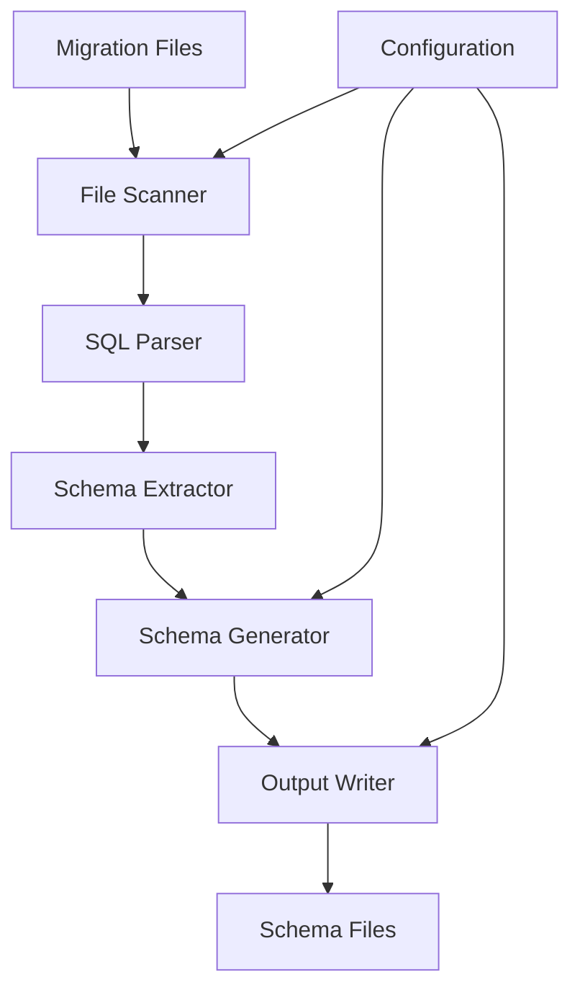

# Design Document

## Overview

The Declarative Schema Generator is a Node.js/TypeScript tool that parses Supabase migration SQL files and converts them into a human-readable, structured schema representation. The tool will use SQL parsing libraries to extract database schema information and output it in JSON or YAML format, making it accessible to developers who prefer declarative configuration over imperative SQL.

## Architecture

The system follows a pipeline architecture with distinct phases:

1. **File Discovery**: Scan migration directories for SQL files
2. **SQL Parsing**: Parse SQL statements to extract schema elements
3. **Schema Extraction**: Convert parsed SQL into structured data models
4. **Schema Generation**: Transform extracted data into declarative format
5. **Output Writing**: Write formatted schema to files



## Components and Interfaces

### Core Components

#### 1. FileScanner
```typescript
interface FileScanner {
  scanMigrations(directory: string): Promise<MigrationFile[]>
  readMigrationContent(file: MigrationFile): Promise<string>
}

interface MigrationFile {
  path: string
  filename: string
  timestamp: string
  content?: string
}
```

#### 2. SQLParser
```typescript
interface SQLParser {
  parseSQL(content: string): ParsedSQL
  extractStatements(content: string): SQLStatement[]
}

interface ParsedSQL {
  statements: SQLStatement[]
  errors: ParseError[]
  warnings: ParseWarning[]
}

interface SQLStatement {
  type: 'CREATE_TABLE' | 'CREATE_INDEX' | 'CREATE_TRIGGER' | 'CREATE_POLICY' | 'ALTER_TABLE'
  raw: string
  parsed: any
}
```

#### 3. SchemaExtractor
```typescript
interface SchemaExtractor {
  extractTables(statements: SQLStatement[]): TableDefinition[]
  extractIndexes(statements: SQLStatement[]): IndexDefinition[]
  extractTriggers(statements: SQLStatement[]): TriggerDefinition[]
  extractPolicies(statements: SQLStatement[]): PolicyDefinition[]
  extractFunctions(statements: SQLStatement[]): FunctionDefinition[]
}
```

#### 4. SchemaGenerator
```typescript
interface SchemaGenerator {
  generateSchema(extractedData: ExtractedSchema): DeclarativeSchema
  applyConfiguration(config: GeneratorConfig): void
}

interface DeclarativeSchema {
  version: string
  metadata: SchemaMetadata
  tables: Record<string, TableSchema>
  indexes: Record<string, IndexSchema>
  triggers: Record<string, TriggerSchema>
  policies: Record<string, PolicySchema>
  functions: Record<string, FunctionSchema>
}
```

#### 5. OutputWriter
```typescript
interface OutputWriter {
  writeJSON(schema: DeclarativeSchema, path: string): Promise<void>
  writeYAML(schema: DeclarativeSchema, path: string): Promise<void>
}
```

## Data Models

### Table Schema
```typescript
interface TableSchema {
  name: string
  schema: string
  columns: Record<string, ColumnSchema>
  constraints: ConstraintSchema[]
  rls_enabled: boolean
  policies: string[]
  indexes: string[]
  triggers: string[]
  comment?: string
}

interface ColumnSchema {
  type: string
  nullable: boolean
  default?: any
  primary_key: boolean
  foreign_key?: ForeignKeyReference
  unique: boolean
  comment?: string
}

interface ForeignKeyReference {
  table: string
  column: string
  on_delete?: string
  on_update?: string
}
```

### Policy Schema
```typescript
interface PolicySchema {
  name: string
  table: string
  operation: 'SELECT' | 'INSERT' | 'UPDATE' | 'DELETE' | 'ALL'
  role?: string
  using?: string
  with_check?: string
  comment?: string
}
```

### Index Schema
```typescript
interface IndexSchema {
  name: string
  table: string
  columns: string[]
  unique: boolean
  partial?: string
  method?: string
  comment?: string
}
```

### Trigger Schema
```typescript
interface TriggerSchema {
  name: string
  table: string
  timing: 'BEFORE' | 'AFTER' | 'INSTEAD OF'
  events: string[]
  function: string
  comment?: string
}
```

### Function Schema
```typescript
interface FunctionSchema {
  name: string
  parameters: ParameterSchema[]
  return_type: string
  language: string
  security: 'DEFINER' | 'INVOKER'
  comment?: string
}

interface ParameterSchema {
  name: string
  type: string
  default?: any
}
```

## Error Handling

### Parse Error Recovery
- Continue processing when encountering unsupported SQL constructs
- Log warnings for skipped elements
- Maintain partial schema generation capability
- Provide detailed error reporting with line numbers and context

### Validation
- Validate foreign key references exist
- Check for circular dependencies
- Verify policy syntax correctness
- Ensure index column references are valid

## Testing Strategy

### Unit Tests
- Test each component in isolation
- Mock dependencies for focused testing
- Test error conditions and edge cases
- Validate output format correctness

### Integration Tests
- Test complete pipeline with sample migration files
- Verify output matches expected schema structure
- Test with real Supabase migration files
- Validate different SQL dialect handling

### Test Data
- Create sample migration files covering all supported features
- Include edge cases like complex constraints and policies
- Test with malformed SQL to verify error handling
- Use actual migration files from the current project

## Configuration

### Generator Configuration
```typescript
interface GeneratorConfig {
  input: {
    migrationsPath: string
    filePattern?: string
  }
  output: {
    format: 'json' | 'yaml' | 'both'
    path: string
    filename?: string
  }
  options: {
    includeIndexes: boolean
    includeTriggers: boolean
    includePolicies: boolean
    includeFunctions: boolean
    includeComments: boolean
    verbose: boolean
  }
}
```

### CLI Interface
```bash
# Basic usage
npx schema-generator

# Custom configuration
npx schema-generator --config schema-config.json

# Inline options
npx schema-generator --format yaml --output ./schema --verbose
```

## Implementation Approach

### Phase 1: Core Parser
- Implement basic SQL parsing using a library like `node-sql-parser`
- Focus on CREATE TABLE statements
- Extract basic column definitions and constraints

### Phase 2: Advanced Features
- Add support for indexes, triggers, and functions
- Implement RLS policy extraction
- Add comment preservation

### Phase 3: Output Generation
- Implement JSON and YAML output formats
- Add configuration system
- Create CLI interface

### Phase 4: Polish
- Add comprehensive error handling
- Implement validation features
- Add extensive testing
- Create documentation

## Dependencies

### Core Libraries
- `node-sql-parser`: SQL parsing and AST generation
- `js-yaml`: YAML output generation
- `commander`: CLI argument parsing
- `glob`: File pattern matching

### Development Dependencies
- `jest`: Testing framework
- `typescript`: Type checking
- `eslint`: Code linting
- `prettier`: Code formatting