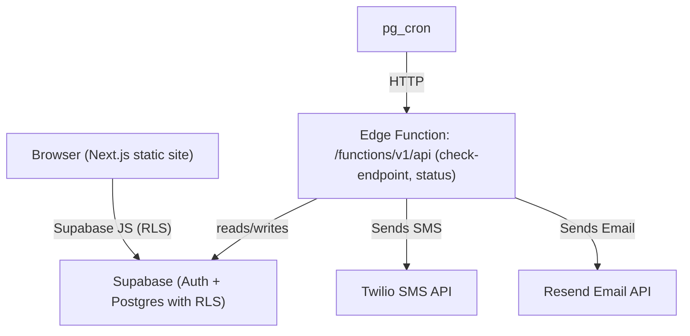

[roorooroo.com](https://roorooroo.com)

[](https://nextjs.org/)
[](https://react.dev/)
[](https://tailwindcss.com/)
[](https://www.typescriptlang.org/)
[](https://supabase.com/)
[](https://deno.com/)
[](https://hono.dev/)
[](#license)


A full‑stack application composed of a static‑exported
[Next.js 14](https://nextjs.org/) frontend and a minimal Supabase server
surface. All database access (CRUD, RPC) happens from the frontend using the
Supabase JavaScript client with Row Level Security (RLS). A single Supabase Edge
Function exists only for server‑only work — executing monitor checks — exposed
at `POST /functions/v1/api/check-endpoint`. It also provides a lightweight
status endpoint at `GET /functions/v1/api/status`.

- Frontend: Next.js 14 + React 18 +
  [Tailwind CSS v4](https://tailwindcss.com/) +
  [Radix UI](https://www.radix-ui.com/) primitives, TypeScript
- Edge Function: Two routes — `POST /functions/v1/api/check-endpoint` (cron) and
  `GET /functions/v1/api/status` (health). The check endpoint runs monitor
  checks that require server‑side secrets/networking
- Database/Auth/Storage: [Supabase](https://supabase.com/) (Postgres + RLS,
  Auth, Storage, Realtime)
- Notifications: Email ([Resend](https://resend.com/)) and SMS
  ([Twilio](https://www.twilio.com/))
- Scheduling: [pg_cron](https://github.com/citusdata/pg_cron) triggers the
  function to perform checks
- CI/CD: [GitHub Actions](https://github.com/features/actions) for function
  deploys and DB ops

> Tip: Quick links — [frontend/](frontend/) •
> [functions/api](supabase/functions/api/) • [migrations](supabase/migrations/)
> • [workflows](.github/workflows/)

---

## Table of contents

- [Motivation](#motivation)
- [Limitations](#limitations)
- [Future Releases](#future-releases)
- [Why a single `/functions/v1/api/check-endpoint`?](#why-a-single-functionsv1apicheck-endpoint)
- [Repository structure](#repository-structure)
- [Architecture](#architecture)
- [Function endpoints](#function-endpoints)
- [Environment variables](#environment-variables)
- [Database and migrations](#database-and-migrations)
- [Frontend notes](#frontend-notes)
- [Deployment](#deployment)
- [Security](#security)
- [Roadmap](#roadmap)
- [License](#license)

## Motivation

This project has two motivations:

1. Build something with as many [Supabase](https://supabase.com/) features as
   possible for my onboarding “dogfooding” project at Supabase.
2. Create a tool that can watch websites for changes so people don’t need to
   waste time refreshing websites by hand.

## Limitations

- Users must have a `@supabase.io` email address
- Content must exist pre‑hydration in the raw HTML (no client‑only content)
- Does not adhere to
  [`robots.txt`](https://developers.google.com/search/docs/crawling-indexing/robots/intro)

## Future Releases

- Support for Supabase Realtime
- Support for browser automation (flexibility and reliability)
- LLM integration for natural language watcher specifications
- Caching and performance optimizations

## Why a single `/functions/v1/api/check-endpoint`?

We’ve moved from a “full API” in Edge Functions to Supabase’s recommended
architecture: use the Supabase client from the browser/app for all database
access under RLS, and reserve Edge Functions for server‑only tasks. For this
project, the only server‑only task is running monitor checks (fetching and
parsing external pages, sending notifications, using secrets). Reducing the
server surface area improves security, maintainability, and cost.

## Repository structure

```text
frontend/
  app/
  components/ui/
  lib/supabase/
  next.config.mjs
  package.json
supabase/
  config.toml
  functions/api/
    index.ts
    routes/
    middleware/
    lib/
  migrations/
.github/
  workflows/
```

- Frontend: Next.js app with UI primitives in
  [`components/ui`](frontend/components/ui/) and Supabase helpers in
  [`lib/supabase`](frontend/lib/supabase/). See
  [`next.config.mjs`](frontend/next.config.mjs).
- Supabase: Local config [`config.toml`](supabase/config.toml), SQL migrations
  in [`migrations/`](supabase/migrations/), and Edge Function in
  [`functions/api`](supabase/functions/api/) exposing `POST /check-endpoint` and
  `GET /status`.
- Workflows: GitHub Actions under [`.github/workflows/`](.github/workflows/).

## Architecture



- Frontend (static): Next.js 14 outputs a static site (`output: "export"`)
  served by any static host. All app data access uses the Supabase client in the
  browser under RLS.
- Edge Function: Routes `POST /functions/v1/api/check-endpoint` (cron) and
  `GET /functions/v1/api/status` (health). The check endpoint executes checks
  and sends notifications. Not intended for browser use.
- DB: RLS‑secured Postgres tables. `pg_cron` triggers the function via HTTP.
- Notifications: Email (Resend) and SMS (Twilio).

## Function endpoints

Function name: `api` (served under `/functions/v1/api` on Supabase)

Endpoints:

- POST `/check-endpoint`
  - Full URL: `/functions/v1/api/check-endpoint`
  - Auth: Cron only — provide `X-Cron-Secret` or call with Supabase service‑role
    credentials
  - Purpose: Execute a pending monitor check and emit notifications
  - Usage: Triggered by `pg_cron` (see migrations/SQL helpers). Not for browser
    use.

- GET `/status`
  - Full URL: `/functions/v1/api/status`
  - Auth: Public/read-only
  - Purpose: Lightweight status/health/metadata (no database CRUD)
  - Usage: May be used for uptime checks; ensure no sensitive data is returned.

Local dev examples (Supabase CLI):

- Check: `http://127.0.0.1:54321/functions/v1/api/check-endpoint`
- Status: `http://127.0.0.1:54321/functions/v1/api/status`

Production examples:

- Check: `https://<project-ref>.supabase.co/functions/v1/api/check-endpoint`
- Status: `https://<project-ref>.supabase.co/functions/v1/api/status`

## Environment variables

Frontend (`frontend/.env.local`)

| Name                            | Required | Example                   | Notes                |
| ------------------------------- | -------- | ------------------------- | -------------------- |
| `NEXT_PUBLIC_SUPABASE_URL`      | Yes      | `https://xyz.supabase.co` | Supabase project URL |
| `NEXT_PUBLIC_SUPABASE_ANON_KEY` | Yes      | `eyJhbGciOi...`           | Anonymous key        |
| `VERCEL_ANALYTICS_ID`           | No       | `abc123`                  | Optional             |

Edge Function / project secrets (Supabase dashboard or local `.env`)

| Name                        | Required    | Notes                                    |
| --------------------------- | ----------- | ---------------------------------------- |
| `SUPABASE_URL`              | Yes         | Project URL used by server SDK           |
| `SUPABASE_SERVICE_ROLE_KEY` | Yes         | Service role key (server‑side only)      |
| `CRON_SECRET`               | Recommended | Shared secret validated by the function  |
| `LOG_LEVEL`                 | No          | `debug`                                  |
| `TWILIO_ACCOUNT_SID`        | If SMS      | Twilio account SID                       |
| `TWILIO_AUTH_TOKEN`         | If SMS      | Twilio auth token                        |
| `TWILIO_PHONE_NUMBER`       | If SMS      | Sending phone number                     |
| `RESEND_API_KEY`            | If Email    | Enables email notifications              |
| `FRONTEND_URL`              | No          | e.g., `http://localhost:3000` (for CORS) |
| `PRODUCTION_FRONTEND_URL`   | No          | e.g., `https://roorooroo.app` (for CORS) |

Supabase Auth (referenced in [`supabase/config.toml`](supabase/config.toml))

| Name         | Required | Notes                               |
| ------------ | -------- | ----------------------------------- |
| `JWT_SECRET` | Yes      | JWT signing key managed in Supabase |

GitHub Actions (repo secrets)

- `SUPABASE_PROJECT_ID`, `SUPABASE_ACCESS_TOKEN`, `JWT_SECRET`
- `DATABASE_URL` (used by any db workflows you enable)

## Database and migrations

- SQL lives in [`supabase/migrations/`](supabase/migrations/); applied via the
  Supabase CLI.
- Core schema: see
  [`20240101000000_create_tables.sql`](supabase/migrations/20240101000000_create_tables.sql)
- Cron helpers: see
  [`20240101000004_create_cron_functions.sql`](supabase/migrations/20240101000004_create_cron_functions.sql)

## Frontend notes

- All data access (reads/writes/RPC) should use the Supabase client from
  [`frontend/lib/supabase`](frontend/lib/supabase/). Do not proxy these
  operations through the Edge Function.
- Static export is enabled in [`next.config.mjs`](frontend/next.config.mjs):
  `output: "export"`, `trailingSlash: true`, images unoptimized.
- Scripts in [`frontend/package.json`](frontend/package.json):
  - `pnpm dev` — dev server
  - `pnpm build` — production build
  - `pnpm start` — start prod server (not used for static export)
  - `pnpm lint` — Next/ESLint

## Deployment

- Edge Function: deployed via [`fns-push.yml`](.github/workflows/fns-push.yml)
  using Deno and `supabase/setup-cli`
  - Requires `SUPABASE_PROJECT_ID` and `SUPABASE_ACCESS_TOKEN` secrets
- Database: managed via migrations in CI (Supabase CLI) or manually
- Frontend: static export can be hosted on Vercel or any static host

## Security

- Minimized server surface area: a minimal function surface reduces attack
  surface
- RLS on all tables; browser uses user JWTs via the Supabase client
- The function accepts either `X-Cron-Secret` or service‑role credentials for
  cron invocations
- CORS allows only configured frontend origins — set `FRONTEND_URL` and
  `PRODUCTION_FRONTEND_URL` if needed
- Store secrets in Supabase project secrets, GitHub Actions secrets, or local
  `.env` files (never commit secrets)

## Roadmap

- Validate function deploy workflow before relying on it for production
- If you manage DB changes via CI, keep workflows aligned with
  `supabase/migrations/`

## License

MIT (unless otherwise specified).
