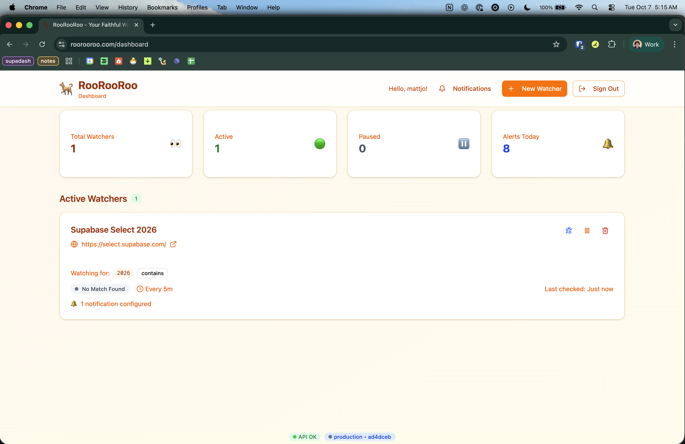
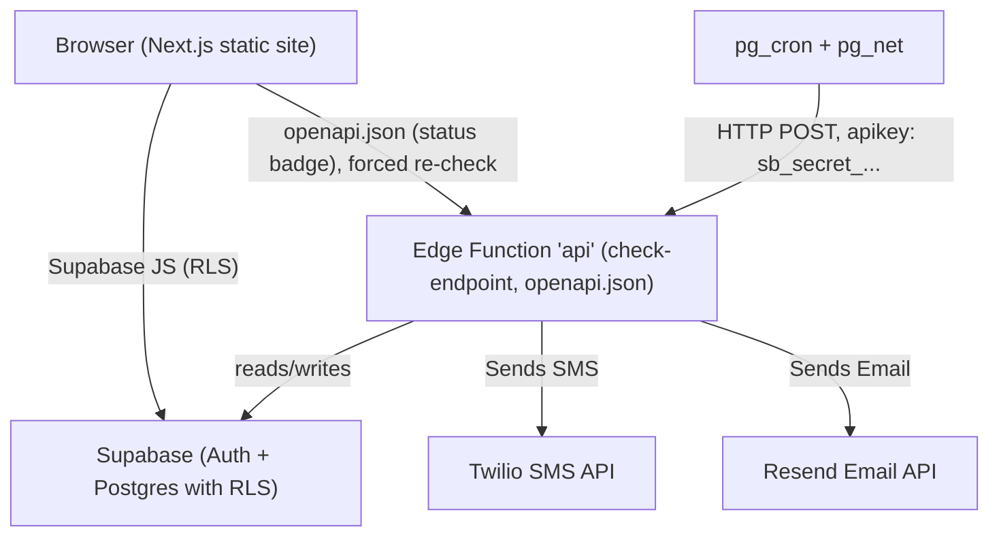

[roorooroo.com](https://roorooroo.com)

[](https://nextjs.org/)
[](https://react.dev/)
[](https://tailwindcss.com/)
[](https://www.typescriptlang.org/)
[](https://supabase.com/)
[](https://deno.com/)
[](https://spec.openapis.org/oas/v3.1.0)
[](#license)



A full‑stack application composed of a static‑exported
[Next.js 16](https://nextjs.org/) frontend and a minimal Supabase server
surface. All database access (CRUD, RPC) happens from the frontend using the
Supabase JavaScript client with Row Level Security (RLS). A single Supabase Edge
Function, `api`, exists only for server‑only work — executing monitor checks —
exposed at `POST /functions/v1/api/check-endpoint`. It also serves its own
OpenAPI document at `GET /functions/v1/api/openapi.json`, which doubles as the
health check.

- Frontend: Next.js 16 + React 19 +
  [Tailwind CSS v4](https://tailwindcss.com/) +
  [Radix UI](https://www.radix-ui.com/) primitives, TypeScript
- Edge Function: one function (`api`) with two routes —
  `POST /functions/v1/api/check-endpoint` (pg_cron or a signed‑in user) and
  `GET /functions/v1/api/openapi.json` (public). Composed from
  [`@supabase/middleware`](https://www.npmjs.com/package/@supabase/middleware)
  and [`@supabase/server`](https://www.npmjs.com/package/@supabase/server); no
  HTTP framework
- Database/Auth: [Supabase](https://supabase.com/) Postgres with RLS on every
  table, plus Supabase Auth (email/password)
- Notifications: Email ([Resend](https://resend.com/)) and SMS
  ([Twilio](https://www.twilio.com/))
- Scheduling: [pg_cron](https://github.com/citusdata/pg_cron) + `pg_net` call
  the function over HTTP to perform checks
- Schema: declarative, diffed by
  [pg-delta](https://supabase.com/blog/declarative-schemas) from
  [`supabase/schemas/`](supabase/schemas/)
- CI/CD: [GitHub Actions](https://github.com/features/actions) for function
  deploys and preview‑branch reporting

> Tip: Quick links — [frontend/](frontend/) •
> [functions/api](supabase/functions/api/) •
> [functions/\_shared](supabase/functions/_shared/) •
> [schemas](supabase/schemas/) • [migrations](supabase/migrations/) •
> [workflows](.github/workflows/)

---

## Table of contents

- [Motivation](#motivation)
- [Limitations](#limitations)
- [Future Releases](#future-releases)
- [Why a single `/functions/v1/api/check-endpoint`?](#why-a-single-functionsv1apicheck-endpoint)
- [Local development](#local-development)
- [Repository structure](#repository-structure)
- [Architecture](#architecture)
- [Function endpoints](#function-endpoints)
- [Pattern matching](#pattern-matching)
- [Environment variables](#environment-variables)
- [Database and schema](#database-and-schema)
- [Frontend notes](#frontend-notes)
- [Preview environments](#preview-environments)
- [Deployment](#deployment)
- [Security](#security)
- [Roadmap](#roadmap)
- [License](#license)

## Motivation

This project has two motivations:

1. Build something with as many [Supabase](https://supabase.com/) features as
   possible for my onboarding “dogfooding” project at Supabase.
2. Create a tool that can watch websites for changes so people don’t need to
   waste time refreshing websites by hand.

## Limitations

- Sign‑up is restricted to `@supabase.io` addresses. The check lives in the
  signup form
  ([`frontend/app/auth/signup/page.tsx`](frontend/app/auth/signup/page.tsx)) and
  is configurable via `NEXT_PUBLIC_ALLOWED_SIGNUP_DOMAIN` /
  `NEXT_PUBLIC_ALLOWED_SIGNUP_EMAILS`. It is a client‑side convention, not a
  database constraint — nothing in Postgres or Supabase Auth enforces it
- Content must exist pre‑hydration in the raw HTML (no client‑only content)
- Does not adhere to
  [`robots.txt`](https://developers.google.com/search/docs/crawling-indexing/robots/intro)
- A check times out after 30 seconds, covering the body read as well as the
  connection; response bodies are buffered up to 5 MB, and regex patterns match
  against at most the first 512 KB
- Regex patterns that can backtrack catastrophically are rejected rather than
  run — see [Pattern matching](#pattern-matching)
- `pg_cron` has a one‑minute floor, and intervals that do not divide evenly into
  an hour fall back to every five minutes (see
  [`frontend/lib/monitor-schedule.ts`](frontend/lib/monitor-schedule.ts))

## Future Releases

- Support for Supabase Realtime (the dashboard currently re‑queries rather than
  subscribing)
- Support for browser automation (flexibility and reliability)
- LLM integration for natural language watcher specifications
- Caching and performance optimizations

## Why a single `/functions/v1/api/check-endpoint`?

We’ve moved from a “full API” in Edge Functions to Supabase’s recommended
architecture: use the Supabase client from the browser/app for all database
access under RLS, and reserve Edge Functions for server‑only tasks. For this
project, the only server‑only task is running monitor checks (fetching and
parsing external pages, sending notifications, using secrets). Reducing the
server surface area improves security, maintainability, and cost.

## Local development

Prerequisites: [Deno 2](https://deno.com/), [pnpm](https://pnpm.io/), Docker
(for the local Supabase stack), and the Supabase CLI (invoked through `npx`, so
no global install is required).

```bash
# 1. Install frontend dependencies
cd frontend && pnpm install && cd ..

# 2. Start the local Supabase stack (Postgres, Auth, Studio, edge runtime)
npx supabase start

# 3. Frontend env — the URL and anon key printed by `supabase start`
#    go in frontend/.env.local

# 4. Edge Function env — TWILIO_* are required to boot; see below.
#    `deno task dev:backend` reads .env at the repo root.
deno task setup-twilio

# 5. Run frontend (:3000) and edge functions (:54321) together
deno task dev
```

Other tasks:

```bash
deno task dev:frontend   # Next.js only
deno task dev:backend    # supabase functions serve --env-file .env
deno task checks         # fns:checks + frontend:checks
deno task fns:checks     # deno fmt --check, lint, type check, and fns:test
deno task fns:test       # unit tests, with placeholder TWILIO_* values
deno task frontend:checks
deno task frontend:build
deno task setup-branching   # wizard: Supabase branching + GitHub integration
deno task setup-vercel      # wizard: Vercel <-> Supabase env sync
```

## Repository structure

```text
frontend/
  app/                    Next.js App Router pages (auth/, dashboard/)
  components/             Feature components
    ui/                   Radix-based primitives
  lib/
    supabase/client.ts    Browser Supabase client singleton
    api-client.ts         Typed fetch wrapper for the Edge Function
    db.ts                 Row types derived from the generated schema
    monitor-schedule.ts   Cron-name and cron-expression helpers
  scripts/                Asset copy step run on postinstall
  next.config.mjs
  package.json
supabase/
  config.toml
  seed.sql                Applied on db reset and on preview branches
  db/database.types.ts    Generated types (deno task db:gen-types)
  functions/
    deno.json             Import map (Deno workspace member)
    api/index.ts          The pipeline: auth gate -> OpenAPI -> handler
    _shared/
      with-openapi.ts     Route table + document middleware
      openapi-document.ts The OpenAPI document (also the route table)
      monitor.ts          Fetch, pattern matching, check logging
      notifications.ts    Email/SMS dispatch and notification logging
      sms-service.ts      Twilio transport with retry
      config.ts           Required env, frontend URL, logger
      *_test.ts           Unit tests
  schemas/                Declarative schema — SOURCE OF TRUTH
  migrations/             Generated output; the deploy artifact
scripts/                  Setup wizards (Twilio, branching, Vercel)
docs/img/                 README assets
.github/workflows/
```

- Frontend: Next.js app with UI primitives in
  [`components/ui`](frontend/components/ui/) and Supabase helpers in
  [`lib/supabase`](frontend/lib/supabase/). See
  [`next.config.mjs`](frontend/next.config.mjs).
- Supabase: local config [`config.toml`](supabase/config.toml), declarative
  schema in [`schemas/`](supabase/schemas/), generated migrations in
  [`migrations/`](supabase/migrations/), and the Edge Function in
  [`functions/api`](supabase/functions/api/) with shared code in
  [`functions/_shared`](supabase/functions/_shared/).
- Workflows: GitHub Actions under [`.github/workflows/`](.github/workflows/).

## Architecture


```mermaid
flowchart TD
  A["Browser (Next.js static site)"]
  DB["Supabase (Auth + Postgres with RLS)"]
  FN["Edge Function 'api' (check-endpoint, openapi.json)"]
  CRON["pg_cron + pg_net"]
  TW["Twilio SMS API"]
  RS["Resend Email API"]

  A -- Supabase JS (RLS) --> DB
  A -- "openapi.json (status badge), forced re-check" --> FN
  CRON -- "HTTP POST, apikey: sb_secret_..." --> FN
  FN -- reads/writes --> DB
  FN -- Sends SMS --> TW
  FN -- Sends Email --> RS
```

- Frontend (static): Next.js 16 outputs a static site (`output: "export"`)
  served by any static host. All app data access uses the Supabase client in the
  browser under RLS.
- Edge Function: one function, `api`, composed as a middleware pipeline —
  `withSupabase` → `withOpenAPI` → handler. The auth gate is outermost, so its
  CORS handling covers every response and no separate CORS layer is needed;
  `auth` includes `none` so the OpenAPI document is reachable from below the
  gate, and the handler refuses `none` so `/check-endpoint` stays private.
- DB: RLS‑secured Postgres tables. `pg_cron` schedules a `pg_net` HTTP POST per
  monitor; the cron command resolves the URL and headers at run time via
  `_get_monitor_check_url()` and `_get_cron_headers()`.
- Notifications: Email (Resend) and SMS (Twilio), dispatched per configured
  channel with per‑channel success reported back in the response.

### Data flow for a monitor check

1. User creates a monitor via the frontend (direct Supabase insert).
2. The frontend calls `create_monitor_cron_job()` to schedule checks.
3. `pg_cron` POSTs `{ monitor_id, user_id }` to
   `/functions/v1/api/check-endpoint`.
4. The function fetches the URL, evaluates the pattern, writes a `monitor_logs`
   row, updates `monitors.last_status` / `last_checked`, and sends notifications
   when the status changed (or on the first check).
5. The dashboard reads `monitors`, `monitor_logs` and `notifications` directly
   from the browser under RLS.

## Function endpoints

Function name: `api` (served under `/functions/v1/api` on Supabase)

Endpoints:

- POST `/check-endpoint`
  - Full URL: `/functions/v1/api/check-endpoint`
  - Auth: either a **user JWT** (`Authorization: Bearer <access token>`,
    verified against the project JWKS) or a **Supabase secret key**
    (`apikey: sb_secret_...`), which is what `pg_cron` presents
  - Body: `{ monitor_id, user_id?, force? }`. In user mode the verified JWT
    subject replaces any `user_id` in the body, and `force` (notify even without
    a status change) is honoured only in user mode
  - Purpose: run one monitor check and emit notifications

- GET `/openapi.json`
  - Full URL: `/functions/v1/api/openapi.json`
  - Auth: public
  - Purpose: the OpenAPI 3.1 document. Its `paths` are the route table the
    function enforces — an endpoint not declared there is not reachable. Serving
    it also proves the function is deployed and running, which is what the
    dashboard status badge polls. `info.version` carries the short commit SHA
    and `info.x-environment` reports `production`, `preview` or `development`

There is no `/status` route; `/openapi.json` replaced it.

Local dev examples (Supabase CLI):

- Check: `http://127.0.0.1:54321/functions/v1/api/check-endpoint`
- Document: `http://127.0.0.1:54321/functions/v1/api/openapi.json`

Production examples:

- Check: `https://<project-ref>.supabase.co/functions/v1/api/check-endpoint`
- Document: `https://<project-ref>.supabase.co/functions/v1/api/openapi.json`

## Pattern matching

A monitor matches with one of three `pattern_type` values (see `checkPattern` in
[`supabase/functions/_shared/monitor.ts`](supabase/functions/_shared/monitor.ts)):

| Type           | Behaviour                                        |
| -------------- | ------------------------------------------------ |
| `contains`     | Case‑insensitive substring match, with a snippet |
| `not_contains` | Inverse of `contains`                            |
| `regex`        | Case‑insensitive regular expression match        |

A `regex` pattern is screened by `findUnsafeRegexConstruct` before it is
compiled and rejected if it can backtrack catastrophically — a quantifier
applied to a group that can match the same input more than one way, such as
`(a+)+$`. A match is synchronous and uninterruptible on the edge worker, so
neither an `AbortController` nor a timer can stop a runaway one; 47 bytes of
input is enough to wedge the isolate. The screen is a heuristic, not a proof.
The complete fix is a linear‑time engine (RE2), which would add a WASM
dependency to the cold‑start path and is deliberately deferred.

## Environment variables

Frontend (`frontend/.env.local`)

| Name                                | Required | Example                                    | Notes                                                                    |
| ----------------------------------- | -------- | ------------------------------------------ | ------------------------------------------------------------------------ |
| `NEXT_PUBLIC_SUPABASE_URL`          | Yes      | `https://xyz.supabase.co`                  | Supabase project URL                                                     |
| `NEXT_PUBLIC_SUPABASE_ANON_KEY`     | Yes      | `eyJhbGciOi...`                            | Anonymous/publishable key                                                |
| `NEXT_PUBLIC_API_BASE_URL`          | No       | `https://xyz.supabase.co/functions/v1/api` | Escape hatch. Defaults to `${NEXT_PUBLIC_SUPABASE_URL}/functions/v1/api` |
| `NEXT_PUBLIC_ALLOWED_SIGNUP_DOMAIN` | No       | `@supabase.io`                             | Signup domain allowlist; defaults to `@supabase.io`                      |
| `NEXT_PUBLIC_ALLOWED_SIGNUP_EMAILS` | No       | `a@x.com,b@y.com`                          | Comma‑separated exceptions to the domain rule                            |

Auth and the Edge Function must come from the **same** project: the function
verifies the browser's JWT against that project's JWKS, so a token minted by a
different project can never match by `kid`. That is why the API base URL is
derived from `NEXT_PUBLIC_SUPABASE_URL` by default.

Edge Function / project secrets (Supabase dashboard, or `.env` at the repo root
for `deno task dev:backend`)

| Name                      | Required | Notes                                                             |
| ------------------------- | -------- | ----------------------------------------------------------------- |
| `TWILIO_ACCOUNT_SID`      | Yes      | Read at module load; see note below                               |
| `TWILIO_AUTH_TOKEN`       | Yes      | Read at module load; see note below                               |
| `TWILIO_PHONE_NUMBER`     | Yes      | Read at module load; see note below                               |
| `RESEND_API_KEY`          | If email | Absent, email sends fail cleanly and are reported per channel     |
| `NOTIFICATION_FROM_EMAIL` | No       | Defaults `notifications@roorooroo.com`                            |
| `TWILIO_WEBHOOK_URL`      | No       | Twilio `StatusCallback` URL                                       |
| `PRODUCTION_FRONTEND_URL` | No       | Preferred base for links in notifications                         |
| `FRONTEND_URL`            | No       | Local fallback for those links; both fall back to the apex domain |
| `LOG_LEVEL`               | No       | `debug` \| `info` \| `warn` \| `error` (default `info`)           |
| `CURRENT_SHA`             | No       | Set in CI; short form becomes `info.version` in the document      |
| `APP_ENVIRONMENT`         | No       | Set to `preview` on preview branches; see below                   |

`SUPABASE_URL`, `SUPABASE_SERVICE_ROLE_KEY` and the newer key material
(`SUPABASE_SECRET_KEYS`, `SUPABASE_PUBLISHABLE_KEYS`, `SUPABASE_JWKS`) are
auto‑provisioned by the platform and by the CLI. `withSupabase` reads them to
build `ctx.supabase` and `ctx.supabaseAdmin` — you do not set them yourself.

`FRONTEND_URL` and `PRODUCTION_FRONTEND_URL` do **not** configure CORS. CORS
uses the canonical wildcard header set from `@supabase/supabase-js/cors`; these
two only decide which origin notification links point at.

> **The three `TWILIO_*` values are required to boot.**
> [`supabase/functions/_shared/config.ts`](supabase/functions/_shared/config.ts)
> reads them at module load, so a deployment without all three fails every
> request, including `/api/openapi.json`. That is intentional fail‑fast:
> discovering missing SMS credentials at deploy time beats discovering them at
> the first alert. Use `deno task fns:test`, which supplies placeholders, when
> running the suite locally.

`APP_ENVIRONMENT` exists because `DENO_DEPLOYMENT_ID` is set on _any_ deployed
function, preview branches included. Without an explicit override every preview
would label itself “production” in the status badge — reassuring exactly when it
should not.

Database settings and Vault (not environment variables)

| Name                        | Where                    | Notes                                                                       |
| --------------------------- | ------------------------ | --------------------------------------------------------------------------- |
| `supabase/secret_key`       | Vault                    | The `sb_secret_...` key `_get_cron_headers()` sends                         |
| `app.settings.secret_key`   | `ALTER DATABASE ... SET` | Fallback when the Vault secret is unavailable                               |
| `app.settings.api_base_url` | `ALTER DATABASE ... SET` | Base for `_get_monitor_check_url()`; falls back to a hard‑coded project URL |

GitHub Actions (repo secrets)

- `SUPABASE_PROJECT_ID`, `SUPABASE_ACCESS_TOKEN` — used by both workflows
- `TWILIO_ACCOUNT_SID`, `TWILIO_AUTH_TOKEN`, `TWILIO_PHONE_NUMBER` — seeded onto
  preview branches, which do not inherit secrets from production. The preview
  workflow fails loudly if any is missing
- `RESEND_API_KEY`, `NOTIFICATION_FROM_EMAIL` — optional, also seeded onto
  preview branches

## Database and schema

The schema is managed **declaratively** with
[pg-delta](https://supabase.com/blog/declarative-schemas), enabled via
`[experimental.pgdelta]` in [`config.toml`](supabase/config.toml).

- **Source of truth**: [`supabase/schemas/`](supabase/schemas/), organized as
  `<schema>/<object-type>/<name>.sql` (plus `_cluster/extensions/`). Edit these
  — never Studio, never the SQL editor, never a hand‑written migration
- **`supabase/migrations/`** is generated output. It is still the deploy
  artifact and the history of record
- **Core tables**: `profiles`, `monitors`, `monitor_logs`, `notifications`, all
  with RLS enabled and user‑scoped policies
- **Helpers**:
  [`supabase/schemas/public/functions/`](supabase/schemas/public/functions/)
  holds `create_monitor_cron_job`, `update_monitor_cron_job`,
  `delete_monitor_cron_job`, `_get_cron_headers`, `_get_monitor_check_url`,
  `vault_get`, and the `on_auth_user_created` handler

```bash
deno task db:sync          # generate a migration from schema edits, then apply locally
deno task db:sync:check    # same, non-interactive; writes the migration, no local apply
deno task db:schema:export # re-export supabase/schemas/ from the local DB (drift recovery)
deno task db:push          # push migrations to the linked project
deno task db:gen-types     # regenerate supabase/db/database.types.ts
deno task db:unsafe-nuke   # destructive reset
```

`db:gen-types` and `db:unsafe-nuke` hard‑code this project's ref in
[`deno.json`](deno.json); a fork needs to change it.

pg-delta diffs schema, not data or platform state. These still need a
hand‑written migration and will never appear in a generated diff: DML (seed and
backfill data), `pg_cron` job rows (created at run time by
`create_monitor_cron_job()`), Vault secrets, and the Supabase‑managed internals
of the `auth` and `storage` schemas. pg-delta is in public alpha — review every
generated migration before pushing, especially anything destructive.

## Frontend notes

- All data access (reads/writes/RPC) uses the Supabase client from
  [`frontend/lib/supabase`](frontend/lib/supabase/). Do not proxy these
  operations through the Edge Function. The one exception is
  [`lib/api-client.ts`](frontend/lib/api-client.ts), which talks to the function
  for the status badge and for a user‑forced re‑check.
- Static export is enabled in [`next.config.mjs`](frontend/next.config.mjs):
  `output: "export"`, `trailingSlash: true`, `skipTrailingSlashRedirect: true`,
  images unoptimized, and `agentRules: false` so Next 16 does not regenerate
  per‑directory agent files alongside the repo's single root `CLAUDE.md`.
- Scripts in [`frontend/package.json`](frontend/package.json):
  - `pnpm dev` — dev server
  - `pnpm build` — production build (static export)
  - `pnpm start` — start prod server (not used for static export)
  - `pnpm lint` — ESLint (flat config, `eslint-config-next`)
  - `postinstall` — copies Twemoji assets into `public/emoji`

## Preview environments

Every PR from a branch in this repo gets its own **Supabase preview branch**,
created by the Supabase GitHub integration. It is a separate Postgres instance
that applies `supabase/migrations/` and `supabase/seed.sql`, starts with **no**
production data, and is destroyed when the PR closes.

[`preview-env.yml`](.github/workflows/preview-env.yml) waits for the branch,
seeds its Edge Function secrets (preview branches inherit none), and posts a
sticky PR comment with the branch's API URL and anon key so a reviewer can point
a local frontend at the PR's own database.

First‑time setup is dashboard work — run `deno task setup-branching`.

**This repo is public.** The workflow triggers on `pull_request` (not
`pull_request_target`) and skips fork PRs, because fork PRs get no secrets and
Supabase does not create preview branches for them. Only the API URL and the
publishable anon key are ever written to a comment — never a Postgres connection
string.

**Preview branches are billable** at the same hourly rate as a project, for as
long as the PR stays open.

## Deployment

- Edge Function: deployed on push to `main` by
  [`fns-push.yml`](.github/workflows/fns-push.yml), which runs
  `deno task fns:checks`, sets `CURRENT_SHA`, then deploys via
  `supabase/setup-cli`. Requires `SUPABASE_PROJECT_ID` and
  `SUPABASE_ACCESS_TOKEN`. `deno task fns:deploy` does the same by hand
- Database: on merge to `main`, the Supabase GitHub integration applies
  `supabase/migrations/` to production. `deno task db:push` remains available
  for manual deploys
- Frontend: static export, hosted on Vercel or any static host. Run
  `deno task setup-vercel` to wire Vercel's env vars to the Supabase integration
  so preview deployments point at the right project

## Security

- Minimized server surface area: two routes, one of which is a public document
- RLS on all tables; the browser uses user JWTs via the Supabase client
- The function authenticates every call itself. `verify_jwt = false` is set for
  `[functions.api]` in `config.toml` because the platform's blanket JWT gate is
  equivalent to `auth: 'user'` on every route and would reject both the public
  document and the secret‑key cron call. The gate moves into the function, it is
  not removed
- Least privilege per caller: a user gets the RLS‑scoped client, cron gets the
  admin client (it has no `auth.uid()` to scope by). Even so, the handler always
  filters by `user_id`, so RLS is a backstop rather than the only control
- A user‑mode caller is pinned to the subject in their verified JWT; a `user_id`
  in the request body is discarded. Only secret mode may name a user
- `_get_cron_headers()` sends only `apikey: <sb_secret_...>`, read from Vault
  with a fallback to `app.settings.secret_key`. It deliberately sends no
  `Authorization` bearer: a credential that is present but invalid is rejected
  outright rather than falling through to a lesser mode
- CORS is the canonical wildcard set from `@supabase/supabase-js/cors`. The API
  is protected by credentials, not by origin
- Store secrets in Supabase Vault, Supabase project secrets, GitHub Actions
  secrets, or local `.env` files — never commit secrets

## Roadmap

- The deploy step in [`fns-push.yml`](.github/workflows/fns-push.yml) is
  annotated `# this is broken`; validate it before relying on it for production
- Replace the regex screen with a linear‑time engine (RE2 via WASM) once the
  cold‑start cost is acceptable
- Enforce the signup domain restriction server‑side (an auth hook) rather than
  only in the signup form

## License

MIT. No `LICENSE` file is checked in yet.
